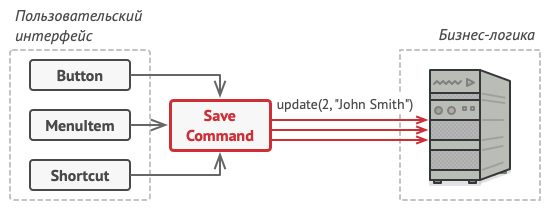

```
# Команда
Команда — это поведенческий паттерн, позволяющий заворачивать запросы или простые операции в отдельные объекты.
Представим ситуацию: один из объектов пользовательского интерфейса напрямую вызывает метод одного из объектов 
бизнес-логики, передавая в него какие-то параметры. Паттерн Команда предлагает больше не отправлять такие 
вызовы напрямую. Вместо этого каждый вызов, отличающийся от других, следует завернуть в собственный класс 
с единственным методом, который и будет осуществлять вызов. Такие объекты называют командами.

Format: 
```